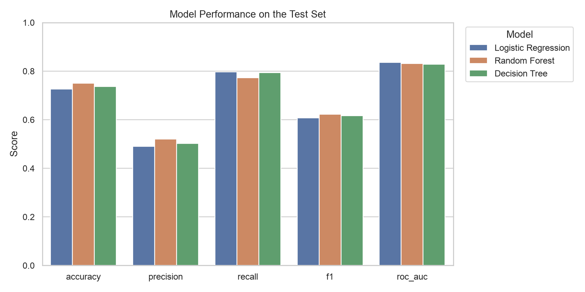
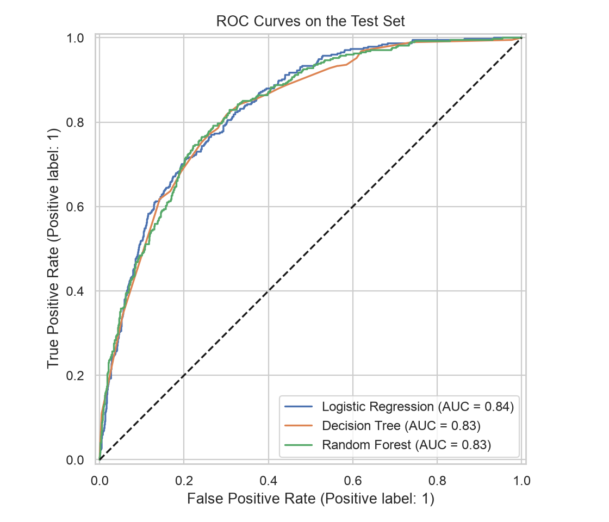
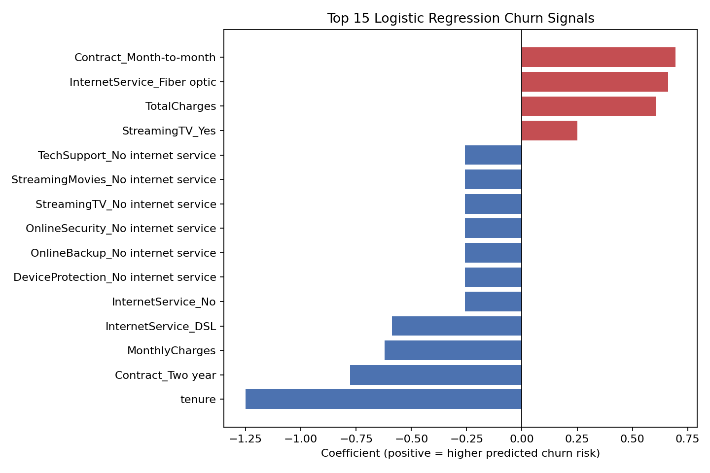
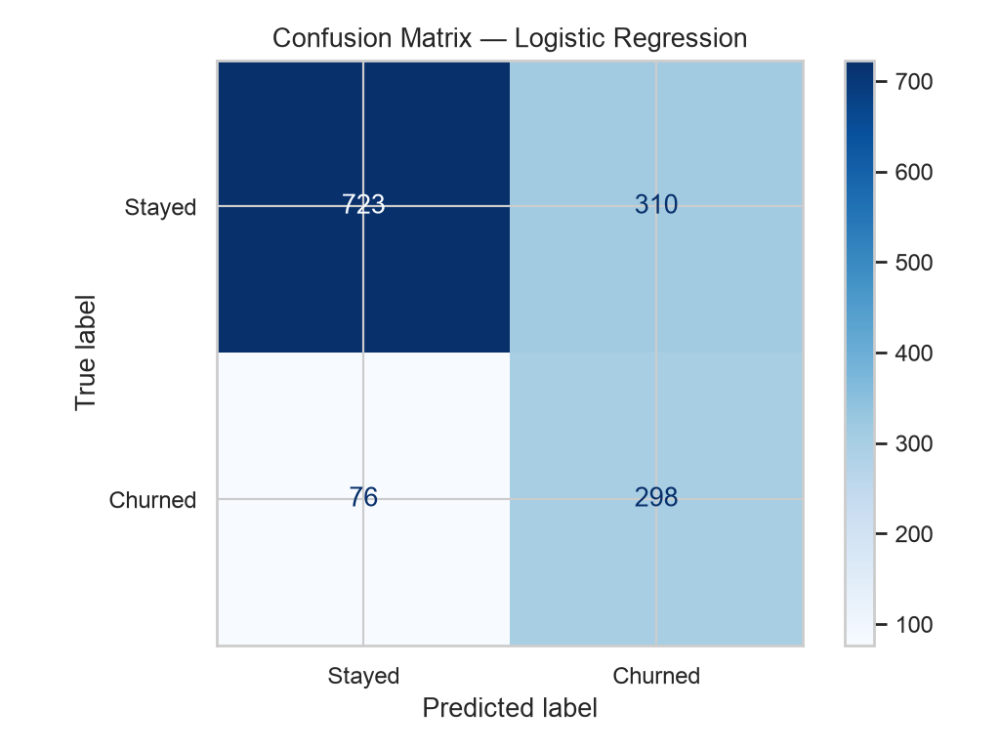

# Telecom Customer Churn Prediction

I built this project to practice using machine learning on a realistic business problem. The goal is to predict which telecom customers are likely to cancel their service. I cleaned the customer data, trained and compared three classification models, evaluated their performance, and created a script that can predict churn risk for a new customer.

## Results

The models were trained on 5,625 records and evaluated on 1,407 previously unseen customers. Logistic Regression achieved the strongest ROC-AUC and was selected as the final model.

| Model | Accuracy | Precision | Recall | F1 | ROC-AUC |
| --- | ---: | ---: | ---: | ---: | ---: |
| **Logistic Regression** | 0.726 | 0.490 | **0.797** | 0.607 | **0.835** |
| Random Forest | **0.751** | **0.521** | 0.773 | **0.622** | 0.832 |
| Decision Tree | 0.736 | 0.503 | 0.794 | 0.616 | 0.828 |

The selected model identified **298 of 374 churners**, or **79.7%**, in the test set. Random Forest produced slightly higher accuracy and F1, while Logistic Regression ranked churn risk best by ROC-AUC.





## Business interpretation

The Patterns that stood out most in the data were:

- Month to month customers churned at **42.7%**, compared with **2.8%** for two year contracts.
- Customers with 0 to 12 months of tenure churned at **47.4%**, compared with **9.5%** for customers with 49 to 72 months.
- Fiber optic customers churned at **41.9%**, compared with **19.0%** for DSL customers.
- Electronic check customers churned at **45.3%** compared to roughly **15–17%** for automatic payments.

These are associations rather than proof that any feature causes churn. They suggest that retention teams could prioritize newer, month to month customers and investigate service or billing friction among the higher risk groups.

The coefficient chart below shows how the selected model used the strongest encoded signals. Because several billing and service variables are correlated, individual coefficient directions should not be interpreted as causal effects.





## What I did

1. Download and validate IBM's 7,043-row dataset.
2. Convert `TotalCharges` to a numeric field and remove 11 unusable rows.
3. Preserve customer IDs for reporting but exclude them from model features.
4. Create a stratified 80/20 train-test split with a fixed random seed.
5. Fit imputation, scaling, and one-hot encoding only on training data.
6. Compare Logistic Regression, Decision Tree, and Random Forest classifiers.
7. Evaluate accuracy, precision, recall, F1, ROC-AUC, ROC curves, and a confusion matrix.
8. Save the best complete preprocessing-and-model pipeline with Joblib.

## Repository structure

```text
telecom-customer-churn/
├── data/raw/                 # Downloaded IBM data (ignored by Git)
├── examples/                 # Example prediction input
├── models/                   # Trained pipeline (ignored by Git)
├── notebooks/               # Guided exploratory analysis
├── reports/
│   ├── figures/              # Portfolio-ready evaluation charts
│   ├── model_metrics.csv
│   └── model_metrics.json
├── src/
│   ├── download_data.py
│   ├── predict.py
│   └── train.py
├── tests/
├── INTERVIEW_GUIDE.md
├── README.md
└── requirements.txt
```

## Run locally

```bash
python3 -m venv .venv
source .venv/bin/activate
python -m pip install -r requirements.txt
python src/download_data.py
python src/train.py
```

Generated outputs include model metrics, test predictions, five evaluation charts, and `models/best_churn_model.joblib`.

## Predict a new customer's risk

After training the model:

```bash
python src/predict.py --input examples/sample_customer.json
```

The command validates all required fields and returns a churn prediction, probability, and risk band.

## Dataset

This project uses IBM's fictional Telco Customer Churn sample with 7,043 records and 21 columns covering demographics, tenure, services, contracts, billing, charges, and churn.

- [IBM source repository](https://github.com/IBM/telco-customer-churn-on-icp4d)
- [IBM dataset CSV](https://raw.githubusercontent.com/IBM/telco-customer-churn-on-icp4d/master/data/Telco-Customer-Churn.csv)

## What I would improve next

- The data describes a fictional company and does not establish causal relationships.
- The default 0.50 classification threshold favors recall and creates false positives; a real retention team should tune it using intervention costs and capacity.
- Cross-validation and hyperparameter tuning could provide more stable estimates.
- Production monitoring would be needed to detect data drift and performance changes.

## Author

Croix Pevear — BSc Artificial Intelligence student at Karlstad University
